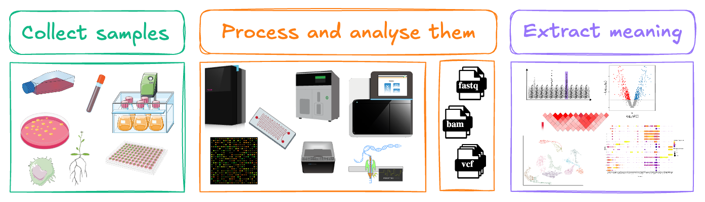
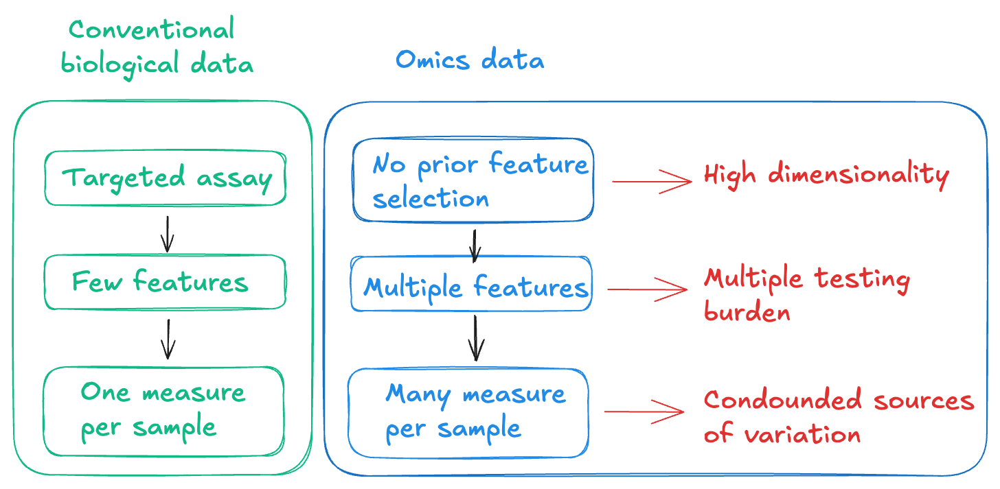
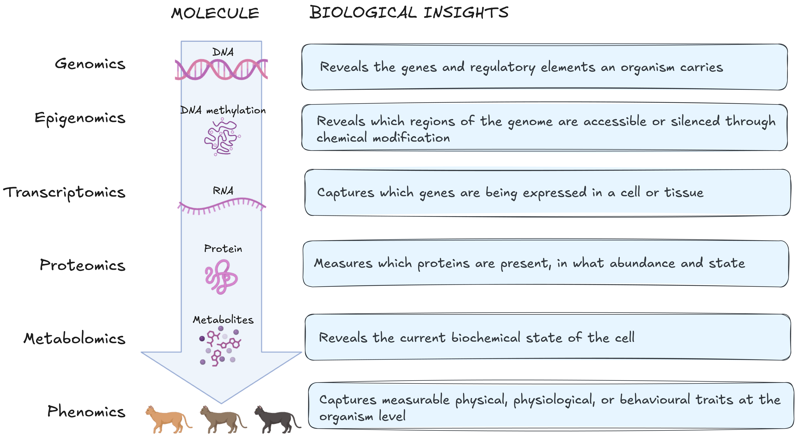
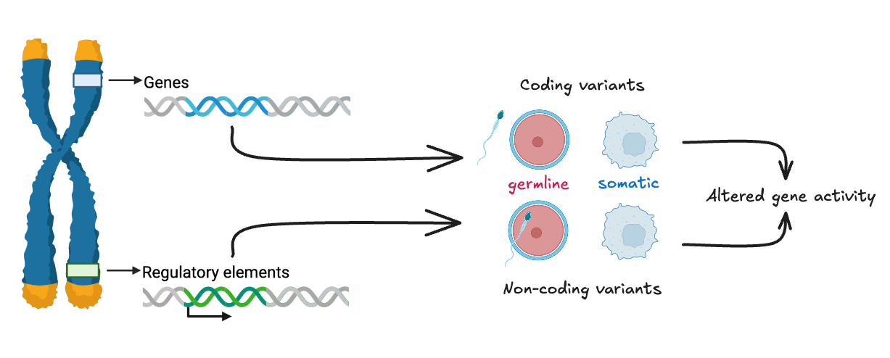
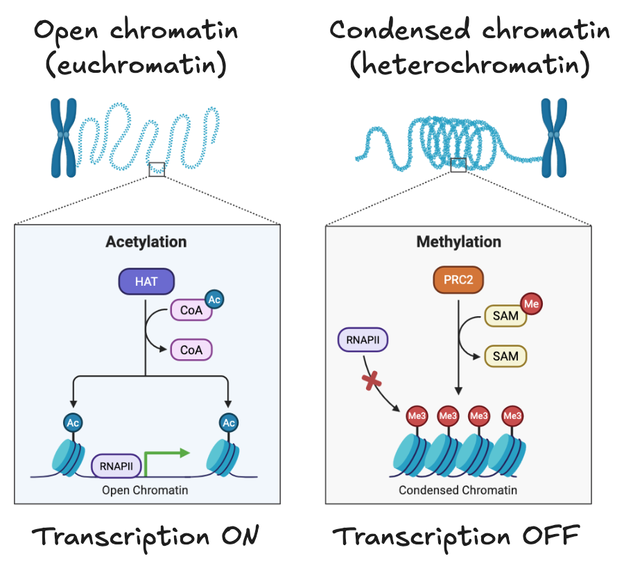
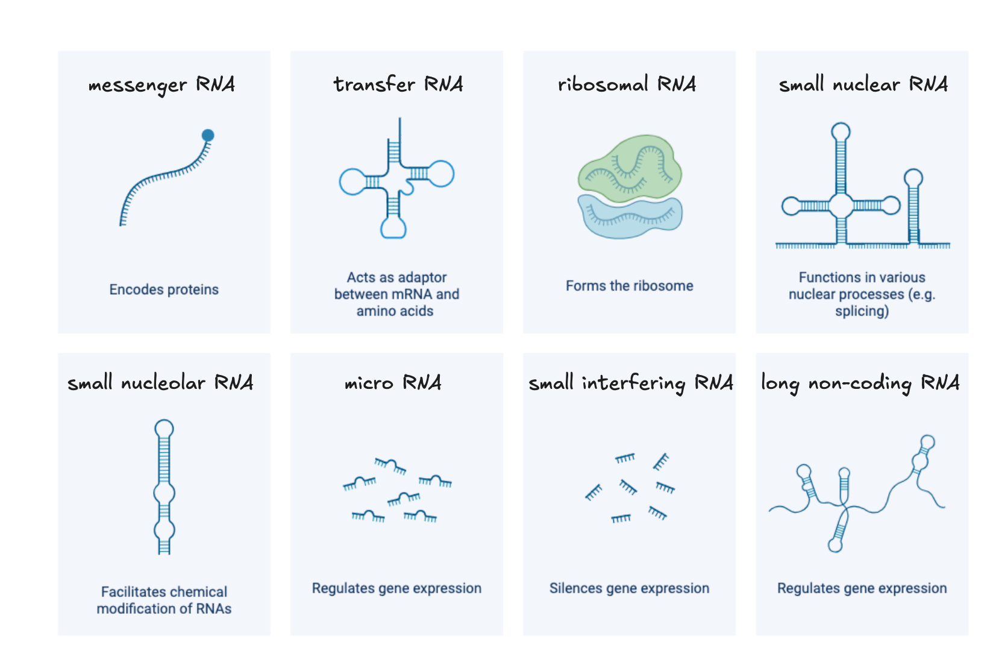

# Module 1.1: The omics landscape

!!! info "Learning objectives"

    - Describe the molecular information captured by each of the five omics layers
    - Explain how the molecular layers relate through the central dogma and its regulatory steps
    - Select the most appropriate molecular layer for a given biological question
    - Evaluate the limitations of each layer and what a chosen layer cannot tell you

Modern biology has undergone a fundamental shift from measuring one biological molecule at a time to profiling entire classes of biological molecules simultaneously. This lets us ask questions not just about individual genes, proteins, or metabolites, but about the state of a whole biological system at the molecular level.

Every living system, whether a bacterium, a migratory bird, or a human, can be interrogated across multiple molecular layers, and each layer reveals a different dimension of how the system works. The choice of which layer or combination of layers to investigate, is one of the most consequential decisions a researcher makes before an experiment begins.

In omics studies, we **collect** and **process** biological samples to determine and **quantify specific classes of molecules**. This allows us to **extract meaningful messages** from large-scale and highly dimensional datasets. 

{width="100%"}

Conventional biological measurements are hypothesis-driven and targeted. They are often performed using targeted assays that allow us to perform single measurements per sample. The statistical model is simple because the data structure is simple. 

Omics experiments are hypothesis generating and untargeted. We measure all members of a molecular class simultaneously, giving us thousands to billions of data points per sample. This creates three analytical consequences we need to be aware of: 

1. **High dimensionality**: We measure many more features than samples 
2. **Multiple testing burden**: When thousands of features are tested for statistical significance simultaneously, the probability of false positives accumulates rapidly.
3. **Confounded sources of variation:** We capture both biological and technical variation simultaneously.  

## From DNA to metabolite

Most biological questions can be investigated at multiple molecular layers. Each molecular layer captures a different aspect of cellular biology. A biological question may be addressed at one layer or several, depending on what is actually driving the phenotype of interest. 

The molecular layers follow a path described by the central dogma of molecular biology: DNA is transcribed to RNA, RNA is translated to protein, and protein actively drives metabolic reactions. Exceptions and regulatory mechanisms complicate this picture but the framework remains a useful starting point for understanding how information flows between layers and where omics technology intervenes. 

!!! warning "The central dogma: exceptions to the rule"
    The central dogma is a useful framework, not a complete description of how biological information flows. Well-established exceptions include [reverse transcription](https://www.pnas.org/doi/10.1073/pnas.2604888123), RNA-based regulation of gene expression through [non-coding RNAs](https://www.cell.com/cell/fulltext/S0092-8674(24)01206-6), and [prion proteins](https://www.nature.com/articles/s41467-022-31460-8) that propagate heritable stats without any nucleic acid template. Our understanding of these exceptions continue to expand. 

The figure below maps these five molecular layers onto the central dogma, showing where each sits in the flow of biological information and what each layer captures.

{width=100%}

Each layer captures a different slice of biology, and no single layer gives the whole picture. To make that concrete, we will follow a single clinical question through all five layers.

!!! question "Research scenario: hypertrophic cardiomyopathy in domestic cats"

    A population of Maine Coon cats are screened at a cardiology clinic. Some have severe hypertrophic cardiomyopathy (HCM). Some have [a known *MYBPC3* variant](https://www.omia.org/OMIA002952/9685/) but no cardiac abnormality. Some have HCM with no identified variant. Same breed, same environment, different outcomes. **What is driving cardiac disease in this population?**

    As you work through each molecular layer below, consider: **what would this layer tell you about what is driving their heart failure, and what would it leave unanswered?**

??? note "Layers overlap: the choice is fit, not exclusivity" 
    Most questions can be approached from more than one layer. The lists below show what each layer is best suited to answer, not what it alone can answer.

    For example, if we want to know how closely two species are related, we can compare their DNA, RNA, or protein sequences. DNA is usually the best starting point because the same genome can be studied from any tissue, and it contains both coding and non-coding regions. 
    
    With RNA, we only capture genes that are expressed in the tissue we sampled. The general rule: **pick the layer where your signal is the dominant source of variation, not one where it competes with variation you are not studying.**

    The order of layers traces information from genomic
    variation through to its molecular consequences. It is a conceptual model,
    not a one way pathway, the layers feed back on each other throughout.
---

### Layer 1: DNA (the genome)

{width=100%}

#### What is it?

DNA contains the instructions required to build and maintain cells. The genome is the complete set of DNA in an organism. 

Most of the genome does not encode proteins. Non-coding regions include regulatory elements like promoters, enhancers, and silencers, that control when, where, and how a gene is transcribed. Genes themselves are organised into exons (coding sequences) and introns (non-coding sequences removed during transcription). The structure of a gene determines which protein isoforms can be produced from it and therefore which downstream layers are affected. 

Understanding the genome is a prerequisite for interpreting the epigenome (which regions are regulated) and the transcriptome (which isoforms are expressed).

#### Role in biology

The genome is a stable repository of hereditary information. It determines which genes an organism possesses, how those genes are structured, and contains the regulatory elements that control gene activity across all downstream molecular layers. Unlike the layers beyond it, the genome changes relatively little across a lifetime. 

#### What this layer can tell us 

Genomics can reveal which genes an organism carries, how they are structured, and what variants are present. This includes single nucleotide variants or polymorphisms (SNV/SNP), small insertions and deletions (indels), structural variants, and copy number changes. Variants may be germline, inherited and present in every cell, or somatic, acquired in specific tissues as in cancer. The non-coding genome is equally informative: variants in promoters, enhancers, and silencers can alter when and where genes are active without changing the protein sequence itself, and are increasingly recognised as important drivers of phenotypic variation.

Beyond individual biology, the genome supports comparative questions. Genomic variation is the basis for reconstructing evolutionary relationships, characterising genetic diversity within and between populations, and identifying signatures of selection. These applications span species identification, population genetics, conservation biology, and the study of how genetic diversity shapes disease susceptibility across groups.

#### What it can't tell us 

The genome describes what an organism could do, not what it is doing. 

A gene's presence tells us nothing about whether it is transcribed, how much protein it produces, whether that protein is active, or what metabolic consequences follow. Two individuals can carry the same variant and present with completely different phenotypes, because gene expression, epigenetic regulation, environment, and chance all mediate the path from genotype to phenotype. The genome also cannot capture somatic changes that arise after development such as epigenetic alterations, transcriptional responses to stress, or acquired mutations in a subset of cells, unless those specific tissues are sampled and sequenced.

??? note "The genome in our research question"

    DNA from blood or buccal swabs can be genotyped or sequenced to identify inherited variants in genes with established roles in hypertrophic cardiomyopathy (HCM). In Maine Coons, a founder [variant in *MYBPC3* (c.91G>C, p.A31P)](https://www.omia.org/variant/omia.variant:901/) encodes a truncated cardiac myosin-binding protein C that disrupts sarcomere assembly. A separate founder variant in Muchkins, Bobtails, and Ragdolls [(*MYBPC3* p.R818W)](https://www.omia.org/variant/omia.variant:902/) has also been identified. Both variants were identified by sequencing affected cats and segregating the variant through family pedigrees.

    In a clinic population, genotyping can classify each cat as homozygous variant, heterozygous, or wild-type. Homozygous cats are more likely to develop severe, early-onset disease. Across a cohort, comparing variant frequency and cardiac phenotype allows genotype–phenotype correlation — but the relationship is not deterministic.

    - **What we learned:** a subset of cats in this population carry a pathogenic variant in a sarcomere gene, providing a molecular explanation for their predisposition to HCM.
    - **What we still don't know:** why heterozygous cats with the same variant differ in clinical outcome, and what is driving disease in cats with no identified variant.
---

### Layer 2: DNA modification (the epigenome) 

{width=80%}

#### What is it?

The epigenome consists of chemical modifications to DNA and its associated histone proteins that determine how accessible different regions of the genome are. 

Two major mechanisms contribute to this: DNA methylation, which typically silences gene expression when it occurs at gene promoters, and histone modifications, which can either compact or open chromatin to restrict or permit transcription.

These modifications regulate gene activity without altering the underlying DNA sequence. The epigenome explains a fundamental puzzle in cell biology: how can a skin cell and a neuron contain identical DNA yet perform completely different functions? The answer lies in systematic epigenetic differences between cell types - which genes are accessible and which are locked away is established during development and maintained across cell divisions.

#### Role in biology

The epigenome acts as the regulatory interface between an organism's fixed genetic sequence and its dynamic environment. Developmental cues, ageing, and environmental exposures, including diet, stress, and toxins, can alter epigenetic marks, changing which genes are available for transcription without changing what those genes encode. The epigenome is therefore the layer at which genetic potential meets environmental context.

#### What this layer can tell us 

Epigenomics reveals the regulatory state of the genome in a given cell type at a given time. By mapping which regions are methylated or carry particular histone marks, we can determine which genes are accessible for transcription and which are silenced — information the DNA sequence alone cannot provide. This is particularly valuable for understanding how the same genome produces different cell types during development, how environmental exposures alter gene regulation over time, and how disease states involve changes in chromatin accessibility rather than changes in sequence. Epigenomic data also helps interpret non-coding variants identified by genomics: a SNP in a regulatory region only has functional relevance if that region is active in the tissue of interest, and the epigenome tells us whether it is.

#### What it can't tell us

Epigenetic changes indicate regulatory potential, not gene expression. An accessible chromatin region means a gene is available for transcription — not that it is being transcribed. Measuring DNA methylation or histone marks tells us nothing about whether accessible genes are actively producing RNA, how much, or in which isoforms. The epigenome also does not reveal the functional consequences of altered regulation — for that, we need to move to the transcriptome and beyond.

??? note "The epigenome in our research question"

    Epigenomic profiling captures heritable changes to gene regulation that are not encoded in DNA sequence, including DNA methylation patterns, histone modifications, and chromatin accessibility at regulatory regions. In cardiac tissue, these marks determine which genes are accessible for transcription and how strongly they are expressed.

    In a population of Maine Coons with identical *MYBPC3* genotypes but divergent cardiac phenotypes, epigenomic data could reveal whether regulatory differences at pro-hypertrophic or fibrotic loci correspond to disease progression. Haemodynamic stress (the mechanical load imposed by a stiffened ventricle) is known to induce epigenetic remodelling in cardiomyocytes, creating an epigenetic record of cardiac history that accumulates before clinical signs appear.

    - **What we learned:** epigenomic profiling could reveal why cats with the same variant differ in outcome — regulatory state, not sequence, may determine penetrance (in some cases, not all carriers of a causative variant develop disease).
    - **What we still don't know:** epigenomic data tells us that regulatory 
      differences exist between cats, but not which differences are causal, 
      which are compensatory, and which are incidental to disease.

---

### Layer 3: RNA (the transcriptome)

{width=100%}

#### What is it?

The transcriptome is the complete set of RNA molecules a cell or tissue is producing at a given moment. 

Where the genome tells us which genes exist and the epigenome tells us which are accessible, the transcriptome tells us which are actually being used. It is the first layer that reflects the cell's current activity rather than its potential.

The transcriptome captures more than which genes are active. Alternative splicing, which is the process by which different combinations of exons are joined during RNA processing, means a single gene can produce multiple distinct transcripts, called isoforms. Each isoform potentially encodes a protein with a different structure or function. Two samples with identical gene-level expression can therefore differ substantially at the isoform level, with functional consequences that gene-level analysis would miss.

Beyond messenger RNA (mRNA), the transcriptome includes non-coding RNAs like microRNAs and long non-coding RNAs, that do not encode proteins but regulate gene expression, chromatin state, and RNA stability. Structural RNAs such as ribosomal and transfer RNAs are also transcribed constituents of the transcriptome, though they are typically removed in standard RNA-seq workflows. The regulatory non-coding RNA fraction is large, incompletely characterised, and increasingly recognised as central to the control of gene expression.

#### Role in biology

The transcriptome is the most dynamic of the molecular layers. It is the primary mechanism by which cells regulate their functional state in response to changing conditions. Gene expression is the main lever cells use to adjust which proteins they produce, which pathways they activate, and how they respond to developmental cues, environmental stress, disease, and treatment. It is the layer at which genetic potential is converted into cellular action.

Gene expression changes rapidly in response to developmental signals, environmental conditions, disease, and treatment. This responsiveness makes it a sensitive readout of cellular state, however what you see in the readout depends heavily on when and from which tissue the sample was collected. A transcriptomic snapshot captures one moment in a continuous, context-dependent process.

#### What this layer can tell us 

Transcriptomics identifies which genes are active in a given cell or tissue, at what level, and in which isoforms. These are questions the genome and epigenome cannot answer directly. Differential expression analysis between conditions, for example disease versus healthy tissue or treated versus untreated cells, can reveal which pathways are engaged and how the cell has reorganised its transcriptional programme in response. Because expression changes rapidly, transcriptomics is also well suited to capturing dynamic processes like responses to acute stress, progression through a developmental stage, or the early effects of a drug.

At the isoform level, transcriptomics can detect alternative splicing events that produce functionally distinct protein variants from the same gene. This is relevant in conditions where splicing is disrupted. Transcriptomic profiling at single-cell resolution adds a further dimension, revealing how gene expression varies between individual cells within the same tissue and enabling the identification of rare cell populations or transitional states that bulk measurements would obscure.

#### What it can't tell us

RNA abundance does not reliably predict protein abundance. Post-transcriptional regulation, including RNA stability, translational efficiency, and protein degradation rates, means that transcript and protein levels can diverge substantially. A highly expressed gene is not necessarily producing abundant or active protein, and a gene with low transcript levels may still maintain significant protein levels due to slow protein turnover. 

??? note "The transcriptome in our research question"

    RNA sequencing from cardiac tissue quantifies gene expression across all cell types present in the sampled tissue (cardiomyocytes, fibroblasts, endothelial cells, immune infiltrates). In a study comparing humans, mice, and domestic cats, single-cell RNA sequencing of *MYBPC3*-associated HCM identified shared transcriptional programmes across feline and human cardiac tissue: upregulation of hypertrophic signalling, fibrotic remodelling pathways, and cell-type-specific stress responses in cardiomyocytes and fibroblasts ([Ali et al., JAHA 2025](https://www.ahajournals.org/doi/epub/10.1161/JAHA.124.035780)).

    Transcriptomic profiling does not require prior specification of which genes to measure. Cats with the same *MYBPC3* genotype but different cardiac phenotypes can be distinguished by their expression profiles as the transcriptome reflects what the heart is actively doing under its current haemodynamic conditions, integrating both genetic predisposition and environmental load.

    - **What we learned:** affected cats show coordinated transcriptional activation of hypertrophic and fibrotic programmes, consistent with what is seen in human MYBPC3 HCM, identifying conserved disease mechanisms.
    - **What we still don't know:** transcriptomics cannot tell us whether sarcomere proteins are being produced at normal stoichiometry, whether truncated MYBPC3 protein is present and incorporated into the sarcomere, or how contractile function is altered at the protein level.

---

### Layer 4: Proteins (the proteome)

{width=100%}

#### What is it?

Proteins are the primary functional molecules of the cell. 

They catalyse the biochemical reactions that sustain life, form the structural scaffolds of cells and tissues, transmit signals, transport molecules, and regulate gene expression. The proteome is the complete set of proteins present in a cell, tissue, or organism at a given time.

Proteins rarely act in isolation. Many assemble into multi-protein complexes that are molecular machines whose activity depends on which subunits are present and in what stoichiometry. The composition of these complexes can determine substrate specificity, regulatory sensitivity, and subcellular localisation in ways that measuring individual protein abundance cannot capture. A protein can be present at normal levels while its binding partners are absent, leaving the complex non-functional.

The relationship between a protein's amino acid sequence and its three-dimensional structure, and therefore its function, is not always predictable from sequence alone. Small sequence differences can produce large structural and functional changes, and post-translational modifications further alter how a protein folds, where it localises, and what it binds. 

#### Role in biology

Proteins execute virtually every cellular function. Unlike RNA, which reflects transcriptional activity, the proteome reflects the cell's actual functional state: which enzymes are present and active, which signalling cascades are engaged, which structural components are intact. The proteome integrates the effects of post-translational modification by phosphorylation, ubiquitination, acetylation, and others, that rapidly alter protein activity, localisation, and stability in response to cellular signals without any change in transcript levels. This regulatory layer is invisible to transcriptomics and only partially visible to genomics, making the proteome essential for understanding how cells respond dynamically to their environment.

#### What this layer can tell us 

Proteomics directly measures the molecules that carry out cellular functions. It can quantify which proteins are present and in what abundance, identify changes in post-translational modification state that alter protein activity or interactions, and detect mislocalisation of proteins to the wrong cellular compartment. In clinical contexts, proteins measurable in accessible biofluids such as plasma or urine serve as biomarkers of tissue-level pathology, reflecting changes in distant tissues that cannot be directly sampled.

Proteomics also reveals discordance with the transcriptome. A transcript can be upregulated while its protein product is rapidly degraded, or a protein can accumulate without a corresponding increase in its mRNA due to changes in translation efficiency or protein stability. These mismatches are biologically meaningful and would be missed by transcriptomics alone. For questions about what the cell is actually doing, the proteome provides evidence that no upstream layer can substitute for.

#### What it can't tell us

Protein abundance alone does not capture activity. A protein can be present in abundance while sequestered in the wrong compartment, held in an inactive conformation by an inhibitor, or absent from its functional complex. Post-translational modifications modulate activity in ways that standard abundance measurements may not detect without modification-specific enrichment strategies. The proteome also does not directly reveal the downstream metabolic consequences of protein activity — for that, the metabolome is needed.

??? note "The proteome in our research question"

    Mass spectrometry-based proteomics quantifies which proteins are present in a sample and at what abundance. [Jiwaganont et al. (2024)](https://pmc.ncbi.nlm.nih.gov/articles/PMC11225243/) looked at the cats with symptomatic HCM versus healthy controls carrying the Bengal A74T variant in *MYBPC3*. Blood serum proteomics by MALDI-TOF and LC-MS/MS identified 269 differentially expressed proteins, including upregulation of integrin subunit alpha M (ITGAM) and fibrillin 2 (FBN2), and downregulation of proteins regulating cardiac fibrosis and transcription. Pathway analysis implicated the Ras and PI3K-Akt signalling pathways, consistent with hypertrophic remodelling.

    - **What we learned:** the serum proteome distinguishes symptomatic HCM cats from healthy cats and identifies dysregulated pathways downstream of sarcomere dysfunction.
    - **What we still don't know:** serum proteomics reflects circulating protein changes, not sarcomere composition directly. To determine whether truncated MYBPC3 is incorporated into the sarcomere, or how contractile protein stoichiometry is altered, cardiac tissue proteomics would be required.

---

### Layer 5: Metabolites (the metabolome)

{width=100%}

#### What is it?

Metabolites are small molecules produced, consumed, or modified during cellular metabolism. 

They include sugars, amino acids, lipids, nucleotides, and organic acids - the substrates and products of the enzymatic reactions that sustain cellular life. The metabolome is the complete set of these molecules present in a cell, tissue, or organism at a given time.

Metabolites occupy a distinctive position in the molecular hierarchy. Where upstream layers describe what the cell has the potential to do (genome), what is being regulated (epigenome), what is being expressed (transcriptome), and what machinery is present (proteome), the metabolome captures what is actually happening biochemically at the moment of measurement. It is the closest molecular readout of physiological state.

Beyond their role as metabolic intermediates, many metabolites function as signalling molecules, linking metabolic state back to gene regulation and completing a regulatory loop that runs in both directions through the molecular hierarchy.

#### Role in biology

The metabolome integrates information from all upstream molecular layers and from the external environment simultaneously. Nutritional state, oxygen availability, drug exposure, physical activity, microbial activity, and cellular stress all leave measurable signatures in the metabolome. This makes metabolomics a sensitive readout of whole-organism physiological state. It also means the metabolome reflects many influences at once, and attributing a metabolic change to a specific upstream cause requires supporting evidence from other layers.

#### What this layer can tell us 

Metabolomics directly measures the biochemical state of a cell or tissue at the time of sampling. It can identify which metabolic pathways are active, quantify the cell's energetic status through ratios such as ATP:ADP or NAD⁺:NADH, and detect the accumulation of pathway intermediates that indicates where a metabolic block has occurred. In disease contexts, characteristic metabolic signatures can serve as biomarkers of pathological state, and in pharmacology, metabolomics captures how a drug alters cellular biochemistry beyond its intended target.

Metabolomics is also the layer that closes the loop between molecular measurements and observable phenotype. The functional consequences of genetic variants, epigenetic changes, altered gene expression, and protein dysfunction ultimately manifest as changes in metabolic output. A metabolic shift observable in plasma or tissue is therefore often the most direct molecular correlate of a clinical phenotype — even when the upstream cause remains unclear.

#### What it can't tell us

The metabolome captures current state, not cause. A metabolic signature tells us what is happening now, not what initiated it. Establishing causality requires integrating evidence from upstream layers. Metabolites are also highly dynamic: concentrations can shift within minutes, and results are sensitive to pre-analytical variables including the time of sample collection, handling, freeze-thaw cycles, and the subject's nutritional state in the hours before sampling. Without rigorous standardisation of collection and processing, technical variation can obscure or mimic biological signal. Finally, the metabolome does not distinguish whether an observed metabolic change is a driver of
pathology, a consequence of it, or a compensatory response.

??? note "The metabolome in our research question"

    In HCM, the metabolome captures the downstream energetic and biochemical consequences of sarcomere dysfunction: shifts in fatty acid and energy metabolism, TCA cycle perturbation, altered glutathione homeostasis, and oxidative stress.

    [Li et al. (2024)](https://pmc.ncbi.nlm.nih.gov/articles/PMC11911622/) profiled 1,253 metabolites in plasma from 83 cats across four HCM stages identifying 167 metabolites that differed significantly between experimental groups, with changes tracking disease progression from preclinical to symptomatic disease.

    - **What we learned:** the metabolome distinguishes HCM cats from healthy cats at preclinical stages, before clinical signs appear, and tracks disease severity across the progression from subclinical to heart failure.
    - **What we still don't know:** the metabolome integrates the output of every upstream layer, it cannot tell us whether the metabolic changes are driven by the sarcomere variant, transcriptional remodelling, protein dysfunction, or haemodynamic load. Disentangling cause from consequence requires data from the layers above.

---

## Summarising the layers 

No single layer answered the question of what is driving these patients' heart failure. Each layer captured a different aspect of the underlying biology, and each left questions that only the next layer could begin to address.

| Layer | What it tells us | What it misses | Phenotypic question addressed |
|---|---|---|---|
| **Genome** | Genetic predisposition | Whether genes are used | Why is this trait heritable? |
| **Epigenome** | Regulatory potential | Whether genes are expressed | Which environments alter trait expression? |
| **Transcriptome** | Gene expression and isoform diversity | Whether proteins are produced and active | Which genes are active in this phenotype? |
| **Proteome** | Functional molecules and their state | Physiological consequences | What is the cell doing to produce this phenotype? |
| **Metabolome** | Current physiological state | The underlying cause | What is the biochemical state associated with this phenotype? |

Each of the five molecular layers described above is studied by its own scientific field. Omics gives us a global view of a biological layer, rather than the targeted measurement of selected molecules that characterised earlier approaches. These layers are interconnected and feed back on each other. The table sets out where each layer is strongest, not a strict division of what each can address in isolation.

!!! question "Walk the layers"

    Form groups based on the organism you work with. Introduce your research to each other in a couple of sentences, then choose a high-level biological question your group wants to work through together.

    Walk through the molecular layers and decide how you would approach your question. Write your answers on butchers paper and report back to the room (2 minutes per group).

    1. **Which molecular layer is suited to answering your question, and why?**
    2. **What can this layer tell you, and what would it miss?**
    3. **What comparisons or timing would be needed to make this study meaningful?**

    ??? example "Clinical / human disease"

        **What is driving these patients' heart failure?**

        A population of patients presents to hospital with heart failure and the underlying cause is unclear. Consider: would you start with inherited predisposition, the current transcriptional state of cardiac tissue, the metabolic status of the failing heart, or something else? What would each layer contribute, and what would remain unanswered?

    ??? example "Wildlife / infectious disease"

        **Why do some populations tolerate an infectious disease while others suffer severe disease from the same pathogen?**

        Consider: is this a host question (immune response, genetic resistance), a pathogen question (strain, virulence factors), or both? Use any host–pathogen system relevant to your field.

    ??? example "Aquaculture / production biology"

        **Why do some farmed fish grow faster than others despite receiving the same diet?**

        Consider: if diet is held constant, what could explain the variation? Genetics, developmental history, physiology, gut microbes? Which layer would you measure first, and how would you sample to make the comparison meaningful?

    ??? example "Plant / environmental stress"

        **How does a crop plant respond to acute environmental stress, and what makes some varieties more tolerant than others?**

        Consider: the stress could be drought, heat, or salinity — pick whichever fits your system. The response happens fast, over hours to days. Which layers capture that timescale, and which are too slow or too stable to see it?

---

!!! info "Module 1.1 takeaways"

    - The five omics layers each capture a different dimension of biological state, ordered by their position in the flow of information from DNA to biochemical function. 
    - The 5 omics layers are connected through the central dogma but are not redundant
    - The layer you choose determines what research questions you can answer, what its limitations are, and what analytical assumptions follow. 