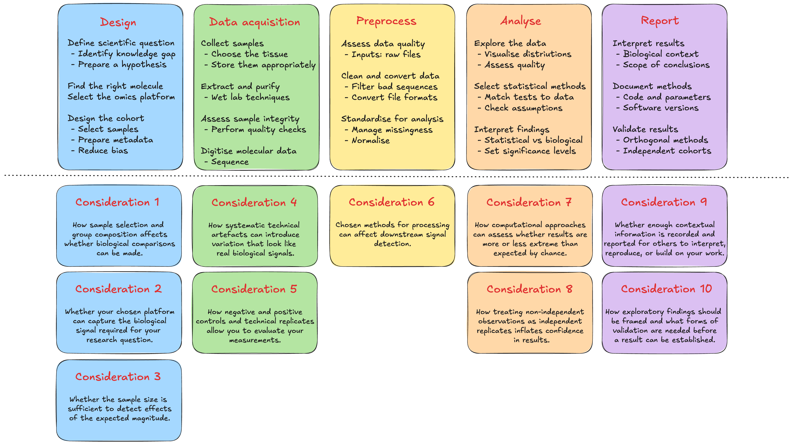

# Module 1.2: The Omics study workflow

!!! info "Learning objectives"

    - Identify the five stages of an omics study and the key decisions made at each stage
    - Explain how methodological choices at one stage constrain what is possible downstream
    - Recognise common sources of bias, technical variability, and analytical error in omics workflows
    - Apply key design, acquisition, and analysis considerations to their own research context

Omics studies follow a common workflow regardless of the molecular layer being interrogated: from initial study design through data acquisition, preprocessing, analysis, and reporting. The decisions made at each stage are interdependent and choices made upstream constrain what is possible downstream. Further, errors introduced early propagate through the pipeline in ways that cannot always be corrected.

The five stages of an omics study are set out in the figure below. Each stage carries decisions with downstream consequences; understanding what those decisions are and why they matter is the focus of this module.

{width=100%}

Each stage of the workflow introduces decisions that shape what is possible downstream. The ten considerations covered in this module are:

| Stage | Consideration | What it covers |
|---|---|---|
| **Design** | Cohort design and confounding | How sample selection and group composition affect whether the biological comparison of interest can be made cleanly |
| **Design** | Platform selection | Whether the chosen measurement technology can capture the biological signal the question requires |
| **Design** | Statistical power | Whether the sample size is sufficient to detect effects of the expected magnitude |
| **Data acquisition** | Batch effects | How systematic technical artefacts can introduce variation that resembles or masks biological signal |
| **Data acquisition** | Experimental controls | How negative controls, positive controls, spike-ins, and technical replicates allow the measurement process to be evaluated |
| **Pre-processing** | Data quality and cleaning | How raw data are evaluated, filtered, and normalised before analysis, and how those decisions affect what enters downstream steps |
| **Analysis** | Analytical controls | How computational approaches can assess whether results are more extreme than expected by chance |
| **Analysis** | Pseudoreplication | How treating non-independent observations as independent replicates inflates confidence in results |
| **Reporting** | Metadata completeness | Whether enough contextual information is recorded and reported for others to interpret, reproduce, or build on the work |
| **Reporting** | Discovery without validation | How exploratory findings should be framed, and what forms of validation are needed before a result can be treated as established |

Some decisions are easier to revisit than others. Analytical choices like normalisation method, filtering thresholds, statistical tests, can often be revised by rerunning the pipeline. Design decisions made before samples are collected are harder to recover from, but understanding their impact helps you assess what your data can and cannot support, and what additional evidence would strengthen the conclusions.
