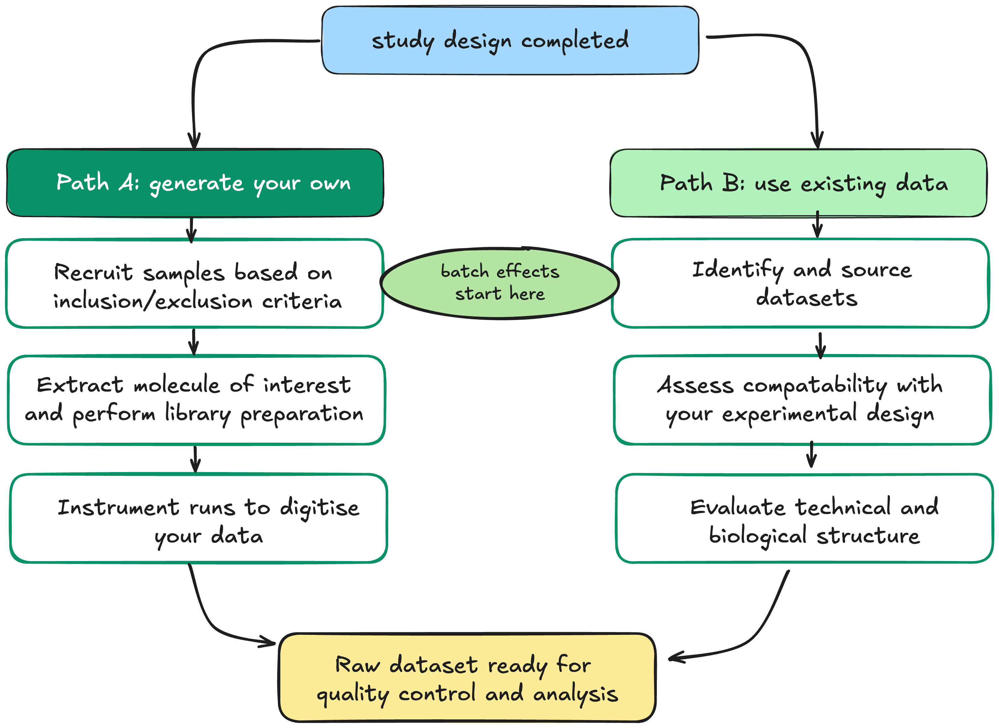
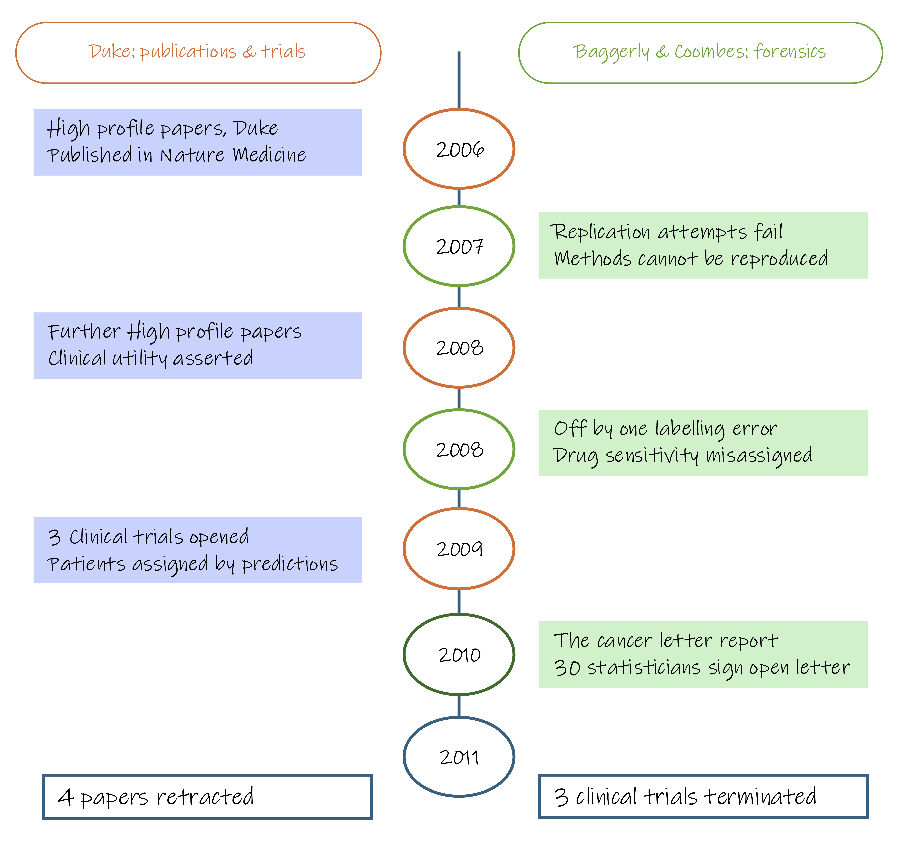

# Module 1.2.2: Data acquisition

Data acquisition is the stage at which biological samples are processed and measured to produce the raw data that will be analysed. The decisions made here include which samples are processed together, in what order, using which instrument settings, and with which controls. These determine the technical structure of your dataset. 

This module covers two paths to data acquisition: generating data specifically for the study, or sourcing existing datasets. Each path introduces different constraints on batch structure, cohort composition, and comparability. We consider two technical complications that apply to data acquisition: batch effects, which arise when technical processing conditions are confounded with the biological comparison, and experimental controls, which monitor the behaviour of the measurement process and must be planned before collection begins.

Technical artifacts enter the scene at the point of sample collection and accumulate through every subsequent processing step. Extraction conditions, reagent lots, operator variation, and instrument run order all introduce technical variation that is present in the raw data before any analysis begins. On Path B, you source data and inherit technical variation already embedded in it. The batch structure, instrument, protocol, and pipeline are fixed at the point of dataset selection.

The two paths are not mutually exclusive. A common and well-powered design can use a either Path A or Path B, or a combination of the two. The risks and trade-offs of each path are summarised below.

| | Path A: generate your own data | Path B: use existing data |
|---|---|---|
| **Benefits** | Full control over sample selection, collection protocol, processing conditions, and batch structure | Faster and lower cost; large existing cohorts may not be reproducible |
| **Burdens** | Time-intensive; recruitment, extraction, and sequencing happen in stages, introducing batch structure by default | Batch structure is fixed and cannot be redesigned; cohort, protocol, instrument, and pipeline are bundled into a single label you cannot separate |
| **Key risk** | Batches that align with your biological comparison e.g. cases processed in year one and controls in year three | Using a public dataset to supply one arm of a comparison e.g. disease and study become perfectly confounded |
| **Key advantage** | You choose which samples go into which batch, the fix is available before any processing begins | Excellent as an independent validation cohort, or when each dataset contributes both comparison groups |

!!! warning "Data acquisition technologies are covered in Module 2"
    This module addresses decisions made during data acquisition including batch structure, controls, and the implications of generating versus reusing data. It does not cover how specific platforms work: how a sequencer converts nucleic acids to base calls, how a mass spectrometer measures peptide or metabolite mass-to-charge ratios, or how signal is processed into a digital readout. Those mechanisms, along with platform-specific considerations, are covered in Module 2.

## Path A: generate your own data

In most studies, samples cannot be processed at the same time. Samples often need to be collected over extended timeframes, stored until they are ready for processing. Then, laboratory processing may occur on different days, using different reagent lots, and data acquisition may occur across multiple instrument runs. **Samples processed or measured under the same technical conditions form a batch**. 

Batches are unavoidable, they are a structural feature of omics work. Batch effects can increase variability and reduce power. When batch membership also aligns with the biological comparison, they can bias the results. If all cases were processed in one batch and all controls in another, batch and biology hold the same shape in the data and cannot be separated.

On Path A, batch assignment is a design decision. Distributing samples within groupings of interest across batches before processing begins prevents complete confounding of batch and condition. Recording batch membership and processing conditions as metadata allows residual batch effects to be modelled during analysis.

## Path B: use existing data

When using existing data, the batch structure is fixed. Study origin may be associated with cohort composition, collection protocol, extraction kit, instrument and analysis pipeline. These effects can be difficult or impossible to separate when study origin is perfectly aligned with the biological comparison.

The most common problem arises when existing data supplies only one arm of a comparison: your own cases paired with public controls, or vice versa. Every case now shares one study and every control shares another. Disease status and study of origin are the same variable. The data cannot tell you whether the observed differences between groups reflect biology or the difference between two laboratories.

Whether existing data can supply one arm of a comparison depends on the platform. Public controls can sometimes be used in genomic studies, particularly for germline genotype data. However, ancestry, assay platform, sequencing coverage, variant calling and quality control procedures must be sufficiently comparable or appropriately harmonised. Otherwise, study of origin may remain confounded with case–control status.

In expression-based omics (transcriptomics, proteomics, metabolomics, epigenomics), the measured signal is highly sensitive to collection conditions. Mixing your own samples with a public dataset on these platforms risks introducing technical differences that are indistinguishable from biological signal.

Public datasets are well-suited as independent validation cohorts for findings already made in your own data, or when each dataset contributes samples from groups of interest.

## Consideration 4: Batch effects

A **batch effect** is a systematic technical bias introduced when samples are processed under different conditions; different sequencing runs, reagent lots, operators, instruments, or processing dates. Unlike random noise, batch effects produce consistent, reproducible patterns in the data that can resemble biological variation or mask it entirely.

- *Unrecoverable design example:* All cases were processed in Batch 1 (2023) and all controls in Batch 2 (2026). Any observed differences between groups are driven by processing year as much as by biology. Because batch and biological group are perfectly aligned, there is no way to determine which differences are technical and which are real. This design is unrecoverable.

- *Recoverable design example:* Cases and controls are distributed across both batches. Both groups are represented in each batch, so the batch effect can be estimated independently of the biological comparison. The batch effect is now separable from the biological comparison and can be modelled during analysis, although statistical adjustment may not remove it completely.

{width=90%}

### Controlling for batch effects

When batch effects are present but not confounded with biology, they can be modelled and adjusted for. This is only possible when batch membership has been recorded in the study metadata, which is why systematic record-keeping is essential at the point of data collection.

Common approaches include:

| Source | Examples | Mitigation at acquisition |
|---|---|---|
| **Processing batch** | Samples extracted or prepared on different days | Process all samples in a single batch where possible; if not, distribute comparison groups across batches |
| **Operator or protocol variation** | Different technicians, reagent lots, kit versions | Standardise protocols; record all deviations as metadata |
| **Run order / instrument drift** | Signal intensity changing across a sequencing or MS run | Randomise sample run order; include quality control samples at regular intervals |
| **Plate or array position** | Edge effects on microarrays or multi-well plates | Randomise sample placement; avoid confounding group membership with position |

Statistical approaches for removing residual batch effects after acquisition are covered in Stage 4.

None of these methods can recover signal from a design where batch is fully confounded with biology. Adjustment requires a design in which batch and the biological comparison can be distinguished. Including both groups in every batch is a strong design choice.

??? example "Case Study: When unreproducible analysis reaches the clinic"

    Researchers at Duke University published a series of high profile papers claiming to have 
    developed gene expression based 
    predictors of chemotherapy response in cancer patients using gene 
    expression microarrays. Three clinical trials were opened using these 
    predictors to assign patients to treatment arms.

    Keith Baggerly and Kevin Coombes at MD Anderson had been trying and 
    failing to replicate the research methods, finding systematic errors 
    in how the data had been processed; including off by one errors in 
    the assignment of drug sensitivity labels to cell lines and undisclosed 
    batch effects in the training data.

    {width="80%}

    ***Outcome***: The clinical trials were subsequently halted amid concerns about the validity of the predictors. The case became an important example of how poor documentation and data-processing errors can undermine reproducibility and potentially place patients at risk.
    <small>Ref: [Baggerly & Coombes, *Ann. Appl. Stat.* 2009](https://doi.org/10.1214/09-AOAS291){target="_blank"}</small>

---

## Consideration 5: Experimental controls

!!! danger "Design principle"
    Controls must be planned before data collection begins. A control that was not included cannot be reconstructed from the data after the fact.

Experimental controls serve a different purpose from biological replicates. Where replicates capture biological variability across individuals or conditions, controls capture the behaviour of the measurement process itself thereby confirming that the assay worked, flagging contamination, and providing a baseline against which to assess technical noise.

In omics experiments, where samples undergo many processing steps in the wet lab before measurement, there are many points at which technical failure can introduce signal that is indistinguishable from biology. Without controls, there is no way to know whether an observed difference reflects the biology of interest or an artefact of how the samples were handled.

Controls generally fall into four categories:

| Control type | Purpose | Examples | Failure indicates |
|---|---|---|---|
| **Negative control** | Detect contamination introduced during processing | Extraction blank, no-template control, solvent blank | Possible contamination; investigate its extent in associated samples |
| **Positive control** | Confirm the assay is functioning | Reference RNA of known concentration, known peptide mixture | Possible assay or run failure requiring investigation |
| **Spike-in** | Assess technical variability between samples; support normalisation | ERCC spike-ins (RNA-seq), stable isotope-labelled internal standards (metabolomics, proteomics) | Technical variability or inconsistent spike-in addition or recovery |
| **Technical replicate** | Estimate measurement reproducibility | Repeated measurement of the same sample across runs or within a run | Greater than expected measurement variability |

Some platforms have additional platform-specific controls that address particular sources of technical failure:

| Domain | Platform or assay | Control or QC assessment | What it detects |
|---|---|---|---|
| Microbiome | 16S amplicon sequencing | Negative extraction control | Reagent or extraction contamination, which can strongly affect low-biomass samples |
| Transcriptome | Bulk RNA-seq | RNA integrity number (RIN) | RNA degradation before or during extraction, transport, or storage |
| Transcriptome | Single-cell RNA-seq | Empty-droplet and ambient-RNA assessment | Empty droplets and cell-free RNA contaminating cell-containing droplets |
| Proteome | Liquid chromatography–mass spectrometry | Blank injections; digestion controls | Carryover between runs; incomplete digestion |
| Metabolome | Liquid/gas chromatography–mass spectrometry | Pooled QC samples at regular intervals | Instrument drift across the run; supports assessment and correction of signal variation |
| Epigenome | Bisulfite-based DNA methylation assay | Bisulfite conversion-efficiency control | Incomplete conversion, which inflates apparent methylation |

The appropriate controls for a given study depend on the platform, the sample type, and the expected sources of technical variability. They should be identified before the relevant processing or acquisition step and included in the study budget. Their placement should follow their purpose: experimental samples may be randomised, whereas pooled QC samples are commonly placed at regular intervals and blanks may be positioned strategically to detect contamination or carryover.

---

!!! info "Module 1.2.2 takeaways"
    - Data can be generated or reused from existing sources; the key difference is how much control you have over the technical structure of the data
    - Batches are unavoidable in omics studies. They become a problem when batch membership aligns with the biological comparison
    - Distributing comparison groups across batches and recording batch membership as metadata are the primary defences against batch confounding. 
    - Using a public dataset to supply one comparison group can confound study origin with biological condition. 
    - Experimental controls are distinct from biological replicates, they monitor the behaviour of the measurement process, not biological variability. 
    - The appropriate controls depend on the platform. 