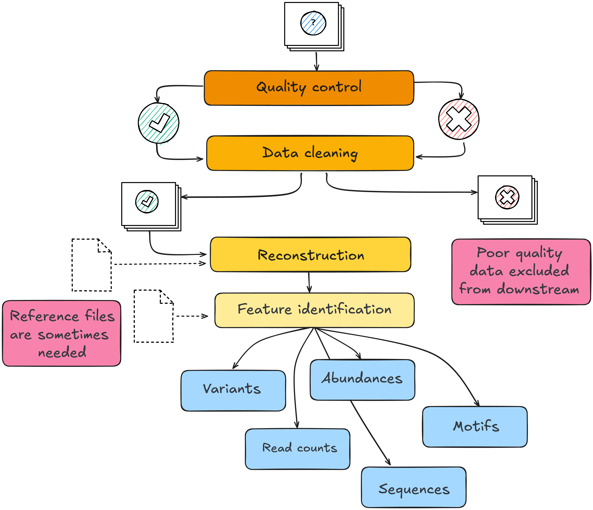

# Module 1.2.3: Pre-processing

Once molecular data is translated into a digital form by a sequencer or mass spectrometer, it undergoes a series of computational processing steps to prepare it for analysis. The data are processed using computational and statistical methods to evaluate data quality, identify and quantify features, and reduce technical variation before addressing the biological question. Not every step will apply to every platform and the order of pre-processing steps and choice of methods matters.

Pre-processing moves raw instrument output through four sequential stages, all of which can be revisited iteratively as problems are identified. **Quality control** evaluates every sample and feature against technical thresholds; observations that fail are either re-evaluated after cleaning or excluded from downstream analysis. **Data cleaning** removes low-quality signals, artefacts, and noise. Samples that fail cleaning do not advance further. **Reconstruction** and **feature identification** translate the cleaned signal into biologically interpretable units. Both stages may require external reference files: a genome assembly, gene annotation, protein sequence database, spectral library, or taxonomic reference. 

These decisions are not neutral. A filtering threshold determines which features enter downstream analysis; excluded features can be recovered only by repeating preprocessing from retained raw or intermediate data. A normalisation method based on assumptions that do not hold can distort downstream comparisons, while an imputation strategy that ignores why values are missing can introduce bias. The choice of genome assembly, gene annotation, or protein database determines which features the pipeline can identify and sometimes reads or signals that do not match the selected reference and will be filtered out of analysis.

Across platforms, preprocessing commonly involves four broad types of task:

| Stage | Purpose | Genome | Transcriptome | Proteome | Metabolome | Epigenome | Microbiome |
|---|---|---|---|---|---|---|---|
| **Quality control** | Identify data quality issues before analysis | Sequence quality, read length distribution | Mapping rate, rRNA fraction | Signal-to-noise ratio, identification rates | TIC stability, QC pool reproducibility | Detection p-values, conversion rate | Read depth, primer removal |
| **Data filtering** | Remove low-quality observations and noise | Low-quality read removal, adapter trimming | Adapter trimming, low-quality read removal | Peak picking, blank subtraction | Feature filtering, solvent blank removal | Failed probe removal | Chimera filtering, host read removal |
| **Reconstruction** | Infer the original biological sequence or structure | Read mapping to reference genome | Read mapping to transcriptome | Peptide-to-protein mapping | Feature annotation against spectral libraries | Read mapping to reference genome | OTU/ASV clustering |
| **Feature identification** | Annotate biologically relevant features | Variant calling | Gene quantification | Protein quantification | Metabolite identification | Methylation calling | Taxonomic assignment, abundance estimation |

??? note "Key terms"
    | Term | Definition |
    |---|---|
    | **Quality control (QC)** | Assessment of raw data to identify samples or features that fail technical thresholds — low sequencing depth, poor alignment rate, high duplicate rate, degraded signal |
    | **Filtering** | Removal of features (genes, proteins, taxa, metabolites) that do not meet a minimum threshold of detection or prevalence across samples |
    | **Missingness** | The absence of a measured value for a feature in one or more samples; can arise from true absence, signal below the detection threshold, or technical failure |
    | **Imputation** | Estimating a missing value from the values that are present, using statistical or data-driven methods |
    | **Normalisation** | Adjustment of measured values to reduce systematic technical differences in scale or distribution — such as differences in sequencing depth, sample loading, or instrument sensitivity — that could obscure biological differences |

!!! tip "Always keep your raw files!"
    Many preprocessing decisions can be revised by rerunning the pipeline, provided that the raw data have been retained. Raw data, reference versions, software versions, parameters, and filtering decisions should therefore be preserved and documented.

---

## Consideration 6: Data quality and cleaning 

!!! danger "Design principle"
    Every pre-processing decision determines what signal enters downstream analysis. These choices are not neutral and often cannot be revised without reprocessing from raw or intermediate data.

### Quality control 

Raw data always contains observations of variable quality. Quality control is the systematic evaluation of data before analysis. It operates at three levels — each capable of introducing a distinct problem:

- **Sample-level QC**: identifies samples that have failed partially during collection or processing. A failed sample adds noise or outliers to group comparisons.
- **Run-level QC**: assesses whether the instrument or sequencing run performed consistently. A drifting instrument introduces a run-wide trend that affects every measurement in that run.
- **Feature-level QC**: checks that individual features meet a minimum standard of detection. Features indistinguishable from background inflate the apparent size of the dataset without contributing signal.

| Omics domain | Platform | QC metric | What an unusual value may suggest |
|---|---|---|---|
| Genome | WGS / WES | Coverage depth and breadth | Insufficient or uneven sequencing, leaving parts of the genome inadequately measured |
| Genome | WGS / WES | Duplication rate | Low library complexity, limited input material, or excessive PCR amplification |
| Genome | WGS / WES | Cross-sample contamination estimate | Mixture of material from different samples or possible sample-handling errors |
| Transcriptome | Bulk RNA-seq | Number of mapped reads | Insufficient usable sequencing depth |
| Transcriptome | Bulk RNA-seq | Mapping rate | Poor read quality, contamination, or an unsuitable reference genome or annotation |
| Transcriptome | Bulk RNA-seq | Proportion of reads mapping to rRNA | Incomplete rRNA depletion, RNA degradation, or low informative RNA content |
| Transcriptome | Single-cell RNA-seq | Proportion of mitochondrial reads per cell | Damaged or dying cells, although expected levels differ among tissues and cell types |
| Proteome | LC-MS/MS | Number of proteins identified per sample | Low sample input, sample-preparation problems, poor injection, or reduced instrument performance |
| Proteome | LC-MS/MS | Total ion current (TIC) | Differences in sample loading, injection, ionisation, or instrument sensitivity |
| Metabolome | LC-MS / GC-MS | CV of feature intensities across pooled QC injections | Analytical variability, instrument drift, or inconsistent injection |
| Metabolome | LC-MS / GC-MS | Signal-to-blank ratio | Signal may reflect background contamination rather than a sample-derived feature |
| Microbiome | 16S / metagenomics | Read count per sample | Low library yield, low microbial biomass, or insufficient sequencing depth; contamination may dominate low-biomass samples |
| Microbiome | 16S / metagenomics | Chimeric sequence rate | PCR amplification artefacts that may inflate apparent diversity |
| Epigenome | DNA methylation arrays | Detection p-value per probe | Probe signal cannot be reliably distinguished from background |
| Epigenome | Bisulfite sequencing | Bisulfite conversion efficiency | Incomplete conversion may cause unmethylated cytosines to be incorrectly called as methylated |

QC metrics should be interpreted together and in the context of the biological reality of your experiment as well as the platform, sample type, controls, and overall data distribution. Comparisons across samples also require consistent acquisition and processing settings. For example, protein-identification counts are comparable only when the same acquisition mode, database-search settings, and identification thresholds were used. QC should be revisited after major filtering or normalisation steps.

---

### Data filtering

Filtering applies defined criteria to remove low-quality samples, observations, or features. It is distinct from QC: QC identifies potential problems; filtering acts on them. A protein quantified in only 2 of 80 samples may provide too little information for reliable estimation; a metabolite whose signal cannot be distinguished from the solvent blank may represent background rather than biological signal; microbiome taxa represented by a single read across the entire dataset are commonly removed.

The risk is that low-prevalence or low-abundance features are not necessarily biologically unimportant. A taxon present in 15% of cases and absent from all controls would be removed by a standard 20% prevalence threshold, along with the only organism differentiating the two groups. A protein consistently detected at low abundance in one condition and absent in another may carry relevant differential information, although the pattern must be evaluated against detection limits and possible technical missingness. The appropriate threshold depends on the platform, the sample size, and what the study is designed to detect.

#### Missingness 

Missingness is the absence of a measured value for a feature in one or more samples. The mechanism of missingness matters because different causes require different responses:

| Cause | Example | Appropriate response |
|---|---|---|
| **True absence** | Taxon not present in sample | Treat as structural zero; imputation is not appropriate |
| **Below detection limit** | Protein below quantification threshold | Platform- and question-dependent; may be imputed or excluded |
| **Random technical failure** | Isolated instrument drop-out | Distinguish from structured patterns before imputing |
| **Structured missingness** | Feature absent in all samples from one condition | Investigate before imputing as it may reflect biology, detection limits, or batch |

The proportion of missingness also matters. A feature missing in the majority of samples in one group cannot be reliably estimated from the few values that remain. Whether it should be imputed, treated as absent, or excluded depends on the platform and the question, but the decision should be explicit and documented.

---

### Reconstruction

Reconstruction infers the original biological sequence or structure from cleaned reads or signals. For sequence-based platforms, this typically means mapping reads to a reference genome or transcriptome, or assembling them de novo. For mass spectrometry-based platforms, it involves matching spectra to a protein sequence or metabolite spectral library. For microbiome data, it involves clustering sequences into operational taxonomic units or resolving amplicon sequence variants.

Three inputs shape what reconstruction produces: 

1. Reference data: 
2. Methods and statistical models
3. Tool parameters 

The **reference data** determines what can be identified. An outdated genome annotation may miss recently characterised genes or assign reads to incorrect loci. A protein database that excludes a taxon or isoform will not identify peptides from it. A spectral library built from a different matrix or instrument type may fail to annotate signals that are present. Where no suitable reference exists, de novo assembly or untargeted annotation introduces additional uncertainty in feature identity.

The **methods** determines how signal is translated into features. Reference-guided alignment, de novo assembly, spectral matching, and sequence clustering make different assumptions and are not interchangeable. Applying an inappropriate method — or one not validated for the platform or sample type — can cause features to be merged, split, or missed entirely.

**Parameters** determine where boundaries are drawn. Similarity thresholds, minimum alignment scores, clustering cutoffs, and mass tolerances all affect which signals are resolved into discrete features and which are discarded. These thresholds are often set to software defaults that were not calibrated for a specific platform, sample type, or biological question.

!!! warning "Remember to record your choices" 

    Reference version, build, and source should be recorded as part of the analysis provenance, alongside the method and key parameters. Results obtained with different references or methods are not directly comparable without acknowledgement of their technical differences.

---

### Feature identification

Feature identification assigns biological identity and quantifies the reconstructed signal. The output depends on the platform: variant calls, gene-level read counts, protein group intensities, metabolite concentrations, methylation beta-values, or taxon abundances.

Ambiguous assignments are common in this step. A sequencing read may map equally well to multiple genomic loci; a peptide may be shared across multiple proteins; a mass feature may match multiple metabolites in the spectral library. You can remove these ambiguities by discarding ambiguous reads, collapsing to gene level, using protein group-level inference, or reporting the best spectral match. But keep in mind this will affect which features are quantified and at what abundance. These decisions should be explicit and consistently applied and well documentrf.

The choice of annotation database also determines interpretability. A feature that is quantified but poorly annotated may not contribute meaningfully to biological interpretation even if it passes all statistical thresholds.

#### Normalisation

Measured values in omics data reflect both biological signal and technical variation. Two samples may produce different read counts, protein intensities, or metabolite peak areas not because the biology differs, but because one sample had more input material, was processed on a different day, or was run on the instrument at a different position in the queue. Normalisation adjusts for systematic technical differences in measurement scale or distribution so that samples can be compared more fairly. It does not necessarily remove batch effects or other structured technical variation.

The appropriate method depends on the platform and the assumptions that hold for the dataset. In RNA-seq, normalisation commonly accounts for differences in library size and composition. In proteomics, methods such as median centring or total-intensity scaling can adjust for differences in overall signal between samples. In metabolomics, appropriate internal standards added before extraction can help monitor and adjust for specific sources of technical variation. Standards and spike-ins must therefore be introduced before the processing step they are intended to monitor.

Some normalisation strategies assume that most features are unchanged between conditions. This assumption is violated when the biological effect is global — for example, a transcriptional shutdown affecting the majority of genes, or a metabolic phenotype characterised by broad shifts in abundance across many metabolites. In such cases, normalisation to a stable reference set or to spike-ins is more appropriate than methods that anchor to the dataset's own central tendency.

---

!!! info "Module 1.2.3 takeaways"
    - Preprocessing decisions, their order, and the implementation determine what information enters downstream analysis.
    - QC should be planned in advance, applied consistently, and documented. It should should be revisited after major filtering or normalisation steps.
    - Filtering removes low-quality or low-prevalence features. Thresholds should reflect the biological question, not pipeline defaults.
    - Missing values arise for different reasons and the appropriate response differs in each case. Structured missingness should be investigated before imputation.
    - The choice of reference datasets determines what can be detected. 
    - Raw data, reference versions, software versions, parameters, and filtering decisions must be retained and documented.
