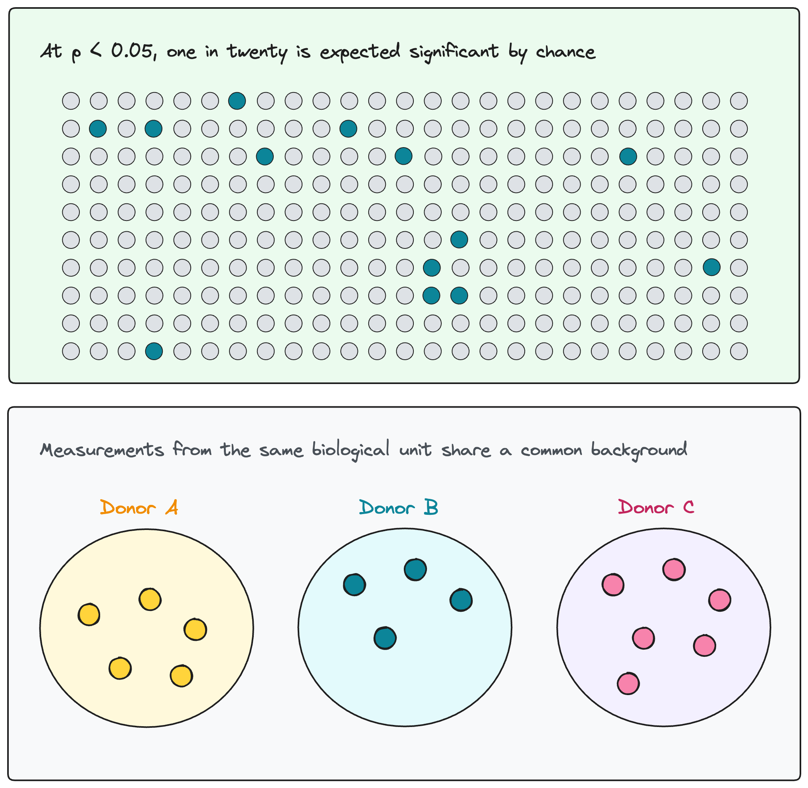
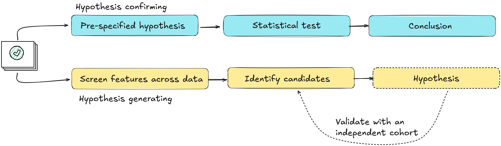
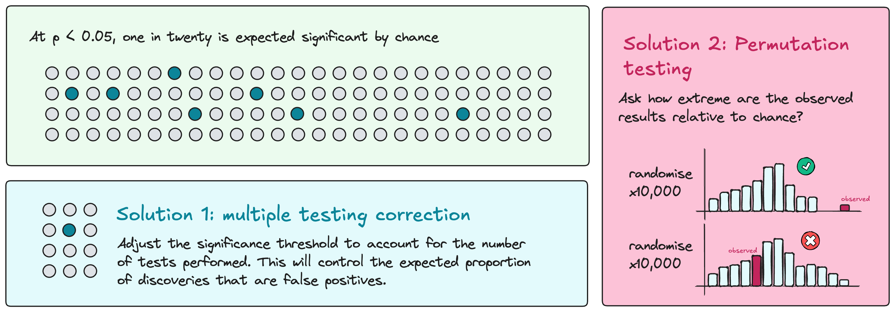
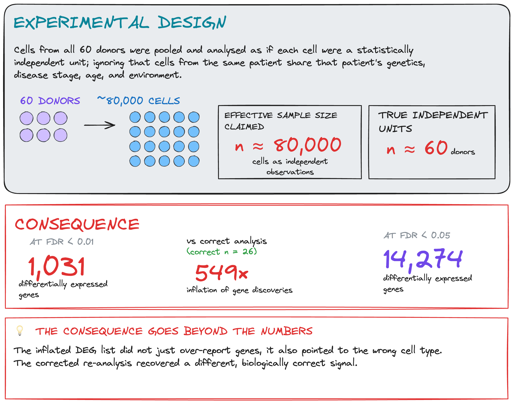

# Module 1.2.4: Analysis

Analysis is the stage at which statistical models are applied to the preprocessed datasets to test the biological question. The model must reflect the structure of the data: the types of variables, the distributional properties of the outcome, any dependencies between observations, and covariates that need to be accounted for. A model that correctly captures these properties produces estimates with appropriate uncertainty; one that does not can overstate confidence or fail to detect real effects.

Covariates are variables associated with the outcome but not the biological question of interest, such as age, sex, or batch. They must be identified before analysis. A model that omits a confounding variable can produce associations that reflect the confounder rather than the biology.

## Challenges at scale 

Analysis in omics is characterised by two challenges that require explicit design decisions.

1. **Thousands of molecular features tested simultaneously.** Testing at this scale increases the expected number of false positives proportionally. Multiple-testing correction reduces this risk but does not eliminate it; computational approaches such as permutation testing can further assess how extreme the observed results are relative to chance.

2. **Observations in omics data are frequently not independent:** cells from the same donor, repeated measurements from the same individual, or subsamples from the same tissue share a common biological background. Treating them as independent replicates inflates the effective sample size and overstates confidence in the results.

## Interpreting results

Statistical significance and biological relevance are not the same. A result can be statistically significant while representing a difference too small to be biologically meaningful. Conversely, a biologically important effect may not reach significance in an underpowered study. Effect sizes, confidence intervals, and measures of practical relevance should be reported and interpreted alongside p-values.

| | **Statistically significant** | **Not significant** |
|---|---|---|
| **Biologically relevant** | **Finding**: result warrants a conclusion | **Missed effect?**: may reflect insufficient power; check effect size and confidence interval |
| **Not biologically relevant** | **False positive or trivial difference**: passes the threshold; does not support a biological conclusion | **True negative**: no effect detected; consistent result |

Analysis in omics can be hypothesis-confirming or hypothesis-generating (exploratory), and the interpretation should match. A hypothesis-confirming analysis tests a pre-specified hypothesis in a defined dataset; its results are conclusions. An exploratory analysis screens a large feature space for candidates; its results are hypotheses. Treating exploratory findings as conclusions without independent replication is a common source of non-reproducible results. The distinction should be decided before analysis begins, not after results are seen.

Translating feature-level statistical results into biological processes, through pathway analysis, gene set enrichment, or similar approaches, is a separate analytical step with its own assumptions. The choice of background set, the handling of overlapping pathways, and multiple testing across pathway sets all affect the output. These methods summarise and contextualise results; they do not validate them.

## Consideration 7: Controlling for false positives

!!! danger "Design principle"
    Testing thousands of features simultaneously increases the expected number of false positives proportionally. Computational approaches can assess whether results are more extreme than expected by chance, but they cannot compensate for missing experimental controls or data that were never collected.

Omics experiments test large numbers of features simultaneously. At a significance threshold of p < 0.05, one in twenty tested features is expected to appear significant by chance alone. Depending on the platform and study design, this can mean hundreds to thousands of false positives in a single analysis. **Multiple-testing correction** reduces this risk by adjusting the threshold at which results are considered significant, accounting for the number of tests performed.

**Permutation tests** provide a complementary approach. By repeatedly rearranging group labels and re-running the analysis, they generate a null distribution of results expected under no association. The observed results can then be assessed against this distribution. The rearrangement must respect the study design, including any pairing or repeated measurements. A permutation that breaks the design structure does not produce a valid null.

??? example "Case study: The placental microbiome"

    Some studies reported a resident community of microorganisms in the
    placenta. However, the amount of microbial DNA detected in placental
    samples is typically very low, making their sequencing results
    particularly vulnerable to contamination.

    Later investigations using extensive controls found no evidence of a
    resident placental microbiome. Much of the detected bacterial DNA was
    attributable to contamination introduced during sample collection or
    laboratory processing. This does not mean that bacteria can never be
    present: occasional pathogens are different from a resident microbial
    community.

    This case illustrates a limit of computational analysis: detecting
    sequences does not, by itself, establish that those sequences originated
    in the tissue. Assessing that requires experimental controls — negative
    extraction controls, reagent blanks — introduced before processing. No
    analytical approach can reconstruct what those controls would have shown.

    <small>
    de Goffau MC et al. Human placenta has no microbiome but can contain
    potential pathogens. *Nature* 572, 329–334 (2019).
    [doi:10.1038/s41586-019-1451-5](https://www.nature.com/articles/s41586-019-1451-5){target="_blank"}

    Salter SJ et al. Reagent and laboratory contamination can critically
    impact sequence-based microbiome analyses.
    *BMC Biology* 12, 87 (2014).
    [doi:10.1186/s12915-014-0087-z](https://link.springer.com/article/10.1186/s12915-014-0087-z){target="_blank"}
    </small>

---

## Consideration 8: Independent replication and pseudoreplication

!!! danger "Design principle"
    Statistical inference should be performed at the level of the experimental unit, not the observational unit. Treating multiple measurements from the same experimental unit as independent replicates inflates the effective sample size and overstates confidence in the results.

As introduced earlier, several measurements may come from the same biological unit. Multiple biopsies or cells from one patient provide more information about that patient, but do not increase the number of independent patients studied.

Treating these measurements as independent biological replicates is **pseudoreplication**. The analysis must account for their shared origin.

Two design choices require particular care when counting independent replicates: subsampling and pooling.

- **Subsampling** means measuring several parts of the same biological unit, such as multiple cells from one donor or multiple biopsies from one patient. These measurements provide more information about that individual, but they do not increase the number of independent individuals studied. The analysis must account for their shared origin.

- **Pooling** Pooling combines material from several biological units into one measured sample. For example, combining samples from five donors into one pool produces one pooled measurement, not five separate donor measurements. Individual differences can no longer be directly assessed from that measurement. Replication depends on how many independent pools were created and how they were constructed.

Neither subsampling nor pooling is inherently a mistake. Pseudoreplication occurs when subsamples are treated as independent biological replicates, or when donors contributing to a pool are counted as separately measured replicates. This can overstate confidence in the results. Dependence between subsamples can often be handled in the analysis, but pooling generally prevents direct assessment of individual differences.

!!! info "Multiplexing is not pooling"
    Multiplexing combines separately barcoded libraries onto the same sequencing run for efficiency. Demultiplexing recovers separate library measurements; whether these represent independent biological replicates depends on the study design. Samples from ten independent patients run together on one lane still represent ten independent biological units. Pooling biological material generally prevents separate measurement of individual contributions, unless these remain distinguishable through genetic differences or other identifiers.

??? example "Case study: Pseudoreplication in single-cell omics"
     The study profiled approximately 80,000 nuclei from 48 individuals and
    included both cell-level testing and a patient-level analysis. Using the
    same processed data, a reanalysis compared the original cell-level results
    with pseudobulk analysis, aggregating counts within each donor and cell type.
    At FDR < 0.05, unique differentially expressed genes fell from 14,274 to 26.
    Fewer discoveries alone do not prove false positives. However, randomly
    reassigning patient labels still produced many discoveries with cell-level
    testing, a pattern not seen with pseudobulk analysis.

    

    <small>Original study: [Mathys et al. "Single-cell transcriptomic analysis of Alzheimer's disease." *Nature* 570 (2019)](https://www.nature.com/articles/s41586-019-1195-2){target="_blank"}</small>

    <small>Reanalysis: [Murphy et al. "Avoiding false discoveries in single-cell RNAseq by revisiting the first Alzheimer's disease dataset." *eLife* 12 (2023)](https://elifesciences.org/articles/90214){target="_blank"}</small>

---

!!! info "Module 1.2.4 takeaways"
    - Studies that lack appropriate experimental controls may be uninterpretable regardless of the analysis applied.
    - Multiple measurements from the same experimental unit must not be
    counted as independent replicates. The analysis can summarise measurements
    within each unit or use a model that accounts for their dependence.
    - Subsampling and pooling require careful counting of independent replicates. More measurements or more donors contributing to a pool do not necessarily mean more independent replicates. 
    - Multiplexing preserves sample identity. Whether samples represent independent biological replicates depends on the study design.

