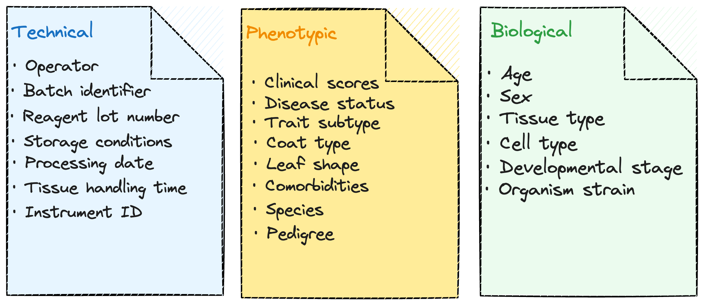
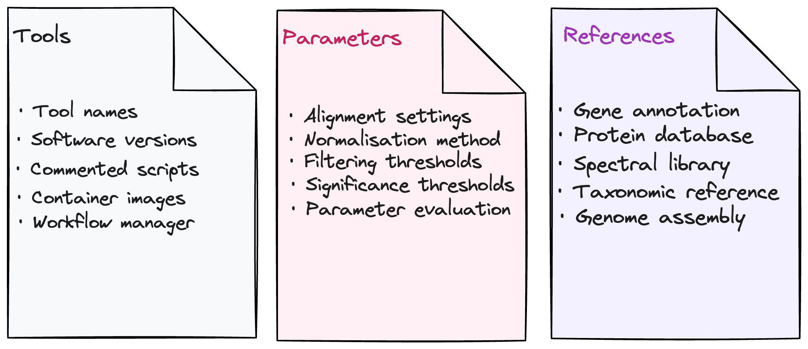

# Module 1.2.5 Reporting

The reporting stage is where findings are communicated, in publications, preprints, code and repositories, and supplementary materials. It is also where many studies fail to provide the information that would allow others to evaluate, reproduce, or build on the work. A technically sound study with poorly documented methods, incomplete metadata, or overclaimed conclusions contributes less to the scientific record than its data would otherwise allow.

Two problems are particularly common in omics reporting: 

1. **Incomplete metadata**: the contextual information about samples, processing conditions, and study design that makes a dataset interpretable
2. **Conflation of discovery with validated finding**: the presentation of results from a single dataset as generalisable biology when they remain candidates awaiting independent confirmation.

??? note "Key terms"
    | Term | Definition |
    |---|---|
    | **Metadata** | Information recorded alongside biological measurements that describes the sample, its collection, processing, and the conditions under which it was generated |
    | **Exploratory analysis** | Analysis intended to generate hypotheses or identify candidates; findings should be treated as provisional |
    | **Confirmatory analysis** | Analysis designed to test a hypothesis specified before examining the relevant results, using a prespecified analysis plan |
    | **Independent cohort replication** | Testing whether a finding holds in new, independent biological samples; the measurement platform may be the same or different |
    | **Orthogonal validation** | Confirming a finding using a different measurement technology,e.g. validating an RNA-seq result with RT-qPCR, or a proteomics finding with immunohistochemistry |

## What to report

### Metadata

Metadata is the contextual information that makes a dataset interpretable: which biological samples were studied, how they were collected, what processing conditions they were exposed to, and what technical factors could have influenced the measurements. Without it, a dataset cannot be evaluated for sources of variation, and findings cannot be placed in their biological context.

### Methods

Methods reporting describes what was done computationally: which tools were used, which versions, which reference databases or assemblies, and which parameters were applied at each step. Omics analyses involve many sequential decisions in preprocessing, normalisation, and statistical modelling. The output can differ substantially depending on your choices at each step. A methods section that names a tool without specifying its version or parameters does not allow the analysis to be reproduced, and does not allow others to assess whether the choices were appropriate for the data.

Together, complete metadata and methods reporting are what allow others to interpret, reproduce, and build on a study.

--- 

## Consideration 9: Metadata completeness

!!! danger "Design principle"
    Report enough information for others to understand the study design, assess the findings, and reproduce the analysis. This depends on recording relevant metadata and methods throughout the study. Missing important metadata may limit our ability to identify sources of variation and adjust for them reliably.

High-quality omics data needs context. Reporting should explain which biological samples were studied, how they were processed, and how the results were produced.

| Category | Examples |
|---|---|
| **Technical** | Processing date, batch identifier, reagent lot number, storage conditions, tissue handling time, operator, instrument ID |
| **Biological** | Age, sex, tissue type, cell type, developmental stage, organism strain |
| **Clinical** | Disease status, disease subtype, medication use, comorbidities, clinical scores, time of sample collection |

Missing metadata can make it difficult to distinguish the biological relationship of interest from other sources of variation. Some information may be recovered from laboratory records or instrument files, and some unwanted variation may be estimated from the data. However, these approaches cannot reliably replace complete records.

| Missing metadata | Platform | Consequence |
|---|---|---|
| Fasting status | Metabolomics | Group differences may reflect diet rather than biology |
| Ischaemia time | Proteomics | Degradation artefacts mistaken for disease effects |
| Processing date | Any | Batch effects present but unidentifiable and uncorrectable |
| RNA integrity score | Transcriptomics | Degraded samples cannot be flagged or excluded retrospectively |
| Reagent lot number | Any | Lot-to-lot variation cannot be accounted for in analysis |

It is good practice to report, what information is missing, which limitations this creates, and how those limitations affect the conclusions.

??? example "Case study: When metadata saves the analysis"
    {width=100%}

## Consideration 10: Discovery without validation

!!! danger "Design principle"
    Statistical significance alone does not establish generalisability or mechanism. The evidence needed depends on the claim being made.

Omics analyses often test thousands of features. False discovery rate (FDR) control helps limit false discoveries when the statistical tests and their assumptions are valid. It does not correct a flawed study design or establish that findings will hold in other populations.

A finding may reflect the particular participants, biological context, or technical conditions of a study. Exploratory findings are valuable, but they should be reported as candidates rather than established biomarkers or mechanisms.

| Study type | Example claim | Validation required? |
|---|---|---|
| Exploratory or hypothesis generating | "We identify candidate features associated with condition X" | Not strictly, if clearly labelled as exploratory |
| Confirmatory or mechanistic | "Gene X drives this pathway in disease Y" | Strongly recommended |
| Translational or clinical | "This signature predicts patient outcome" | Essential |

Different forms of validation address different questions:  

- **Independent cohort replication:** Does the finding hold in new, independent biological samples?  
- **Orthogonal validation:** Does a different measurement method support the finding?  
- **Functional validation:** Does experimentally changing the proposed biological component produce the predicted response?  

Orthogonal validation on the same samples can strengthen confidence in the measurement, but it does not establish generalisability. Independent replication does not, by itself, establish a mechanism.

The challenges of reproducibility and validation are documented across platforms. In transcriptomics, gene signatures derived from small or heterogeneous cohorts frequently show limited reproducibility across independent datasets of the same disease. In metabolomics, an analysis of 244 human serum studies investigating cancer biomarkers found that 72% of the metabolites reported as statistically significant were reported by only one study. In proteomics, translating biomarker discoveries into clinical use remains challenging, with standardisation and validation continuing to be discussed as barriers nearly two decades after [Rifai et al. (2006)](https://doi.org/10.1038/nbt1235) highlighted them.

??? example "Case study: Two decades of unreplicable genetics, the candidate gene era"
    From the 1990s through the mid-2000s, hundreds of candidate gene association studies were published linking specific genetic variants to psychiatric and complex diseases. Many reported statistically significant associations in small samples.

    Larger studies subsequently challenged many of these associations. A landmark 2019 analysis of 18 extensively studied depression candidate genes across multiple large samples found no clear support for the historical candidate-gene hypotheses.

    The lesson is that statistically significant findings from small studies need adequately powered independent replication before being treated as established biology. It was underpowered discovery presented as confirmed biology, without independent replication in adequately sized cohorts. 

    <small>[Border et al. *American Journal of Psychiatry* 2019](https://psychiatryonline.org/doi/10.1176/appi.ajp.2018.18070881){target="_blank"}</small><small>[Cochran et al. *A reproducibility crisis for clinical metabolomics studies*](https://pmc.ncbi.nlm.nih.gov/articles/PMC11999569/){target="_blank"}</small>

---

!!! info "Module 1.2.5 takeaways"
    - Undocumented sources of variation become permanent ambiguities in the dataset.
    - A significant result in a single dataset is a candidate finding. Whether it requires validation, and what form that validation should take, depends on the strength of the claim being made.
    - Independent cohort replication and orthogonal validation are complementary strategies.
    - Omics studies are structurally prone to non-replicable findings.
    - The move from exploratory candidate to confirmed biological finding requires independent evidence.